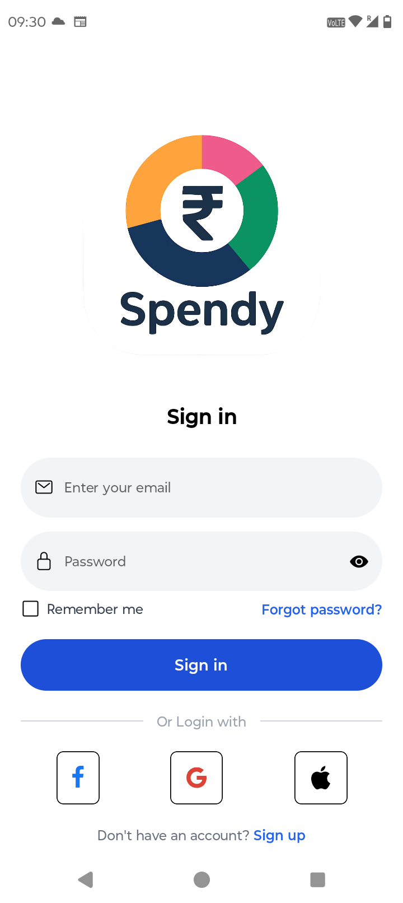
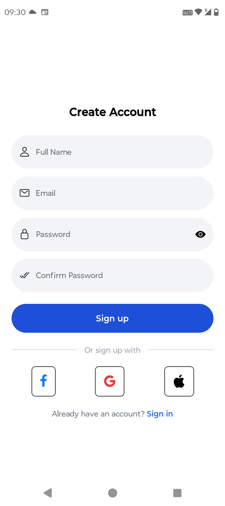
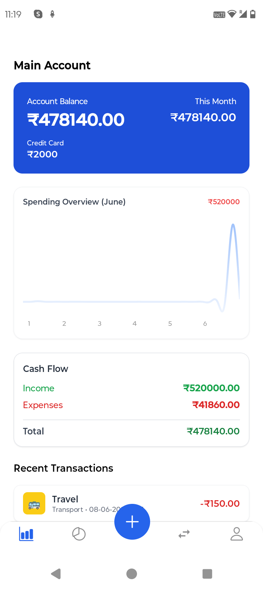
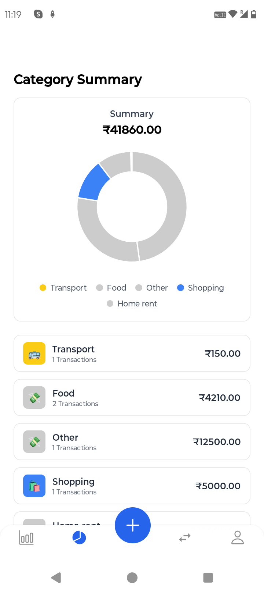
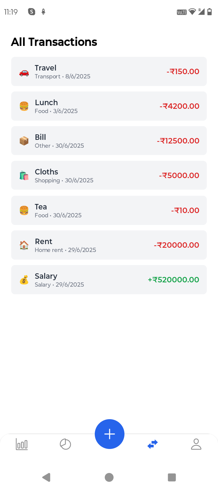
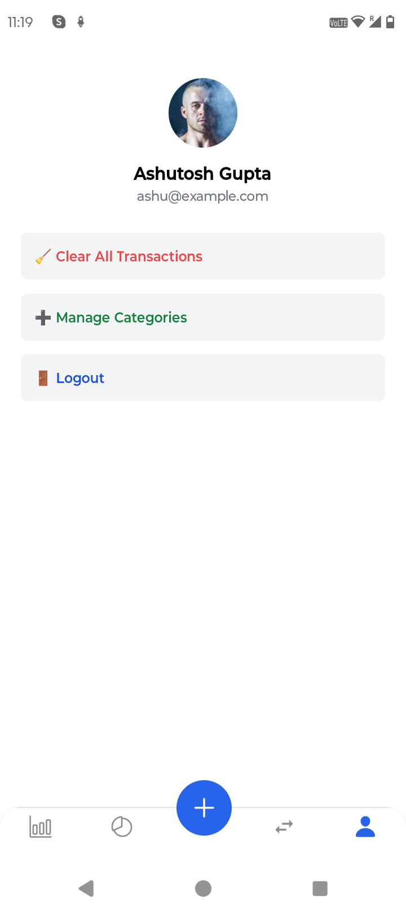
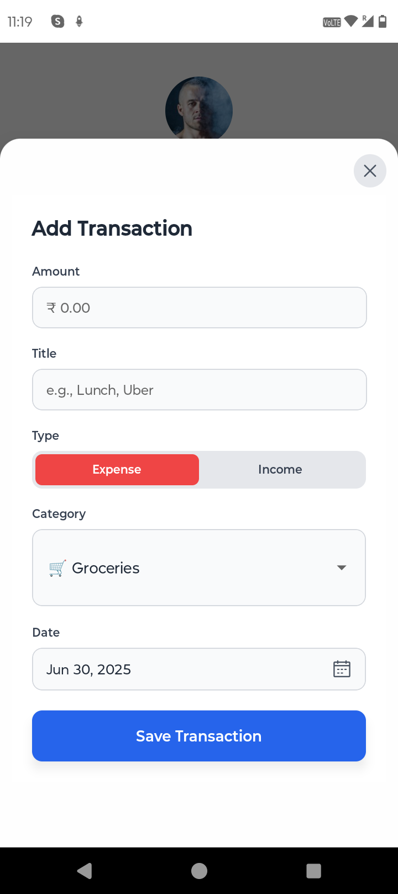

# 💰 Spendy – Your Personal Finance Tracker App

## 📝 Description

**Spendy** is a beautiful, fast, and lightweight mobile finance tracker built with React Native and Expo. With a clean UI and offline-first design, it makes expense tracking simple, intuitive, and accessible to everyone.

---

## 📱 Screenshots

<div align="center">
  
  
  
  
</div>
<div align="center">
  
  
  
</div>

---

## ✨ Features

- 🔐 **Authentication**
  - Signup and login (email + password)
  - Session management with AsyncStorage
  
- 💸 **Transactions**
  - Add expenses or income with amount, title, category, and date
  - Auto-icon & emoji-based categories
  - View recent transactions in dashboard
  
- 📊 **Dashboard & Insights**
  - Account balance, income, and expenses summary
  - Filter: Week, Month, Year, All
  - Line chart visualization
  
- 🏷️ **Categories**
  - Built-in categories with emoji icons
  - Automatically synced across app
  
- 🌙 **Offline-first**
  - No internet? No problem. All data stored locally
  
- 🎨 **Modern UI**
  - Tailwind-like styling with NativeWind
  - Responsive and mobile-first UX

---

## 📲 Screens Included

- `LoginScreen.tsx`
- `SignupScreen.tsx`
- `Dashboard.tsx`
- `AddTransactionScreen.tsx`
- `CategoriesScreen.tsx`
- `ProfileScreen.tsx`

---

## 🔧 Installation Guide

### 1. Clone the Repository

```bash
git clone https://github.com/codingwithashu/spendy-react-native.git
cd spendy-react-native
```

### 2. Install Dependencies

```bash
npm install
# or
yarn install
```

### 3. Start the Development Server

```bash
npx expo start
```

---

## 🧩 Project Structure

```
spendy-app/
├── assets/          # App assets (icons, images, splash, etc.)
├── components/      # Reusable UI components
├── lib/
│   └── api/         # Auth, transaction, and category APIs
├── navigation/      # Stack navigation setup
├── screens/         # Screen components (Login, Dashboard, etc.)
├── types/           # TypeScript interfaces/types
├── utils/           # Helper functions like category icons
├── App.tsx          # App root
├── app.json         # Expo configuration (icon, splash, etc.)
└── README.md
```

---

## 🚀 Getting Started

1. **Prerequisites**: Make sure you have Node.js and Expo CLI installed
2. **Clone & Install**: Follow the installation guide above
3. **Run the App**: Use `npx expo start` and scan the QR code with Expo Go app
4. **Start Tracking**: Create an account and begin managing your finances!

---

## 🛠️ Built With

- **React Native** - Cross-platform mobile development
- **Expo** - Development platform and toolchain
- **TypeScript** - Type-safe JavaScript
- **NativeWind** - Tailwind CSS for React Native
- **AsyncStorage** - Local data persistence

---

## 📝 License

This project is licensed under the MIT License - see the [LICENSE](LICENSE) file for details.

---

## 🤝 Contributing

Contributions are welcome! Please feel free to submit a Pull Request.

1. Fork the project
2. Create your feature branch (`git checkout -b feature/AmazingFeature`)
3. Commit your changes (`git commit -m 'Add some AmazingFeature'`)
4. Push to the branch (`git push origin feature/AmazingFeature`)
5. Open a Pull Request

---

## 📧 Contact

**Ashu** - [@codingwithashu](https://github.com/codingwithashu)

Project Link: [https://github.com/codingwithashu/spendy-react-native](https://github.com/codingwithashu/spendy-react-native)
